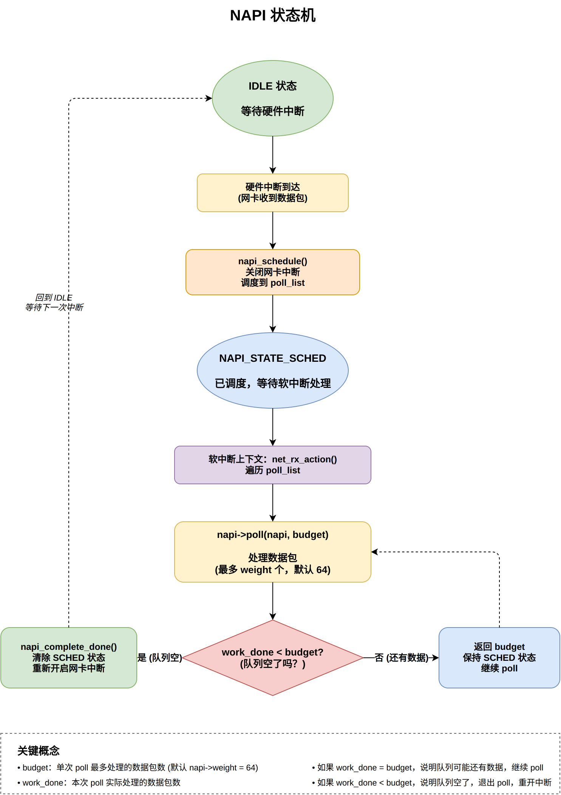
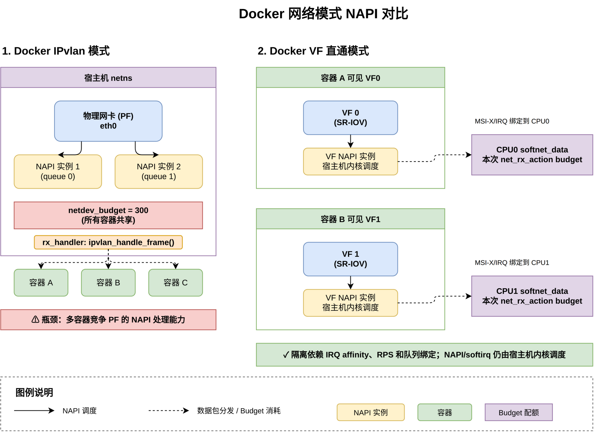
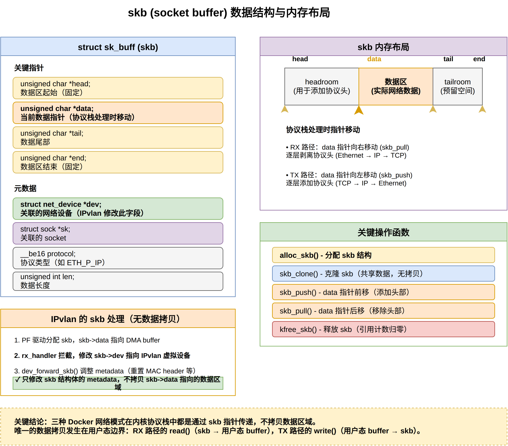
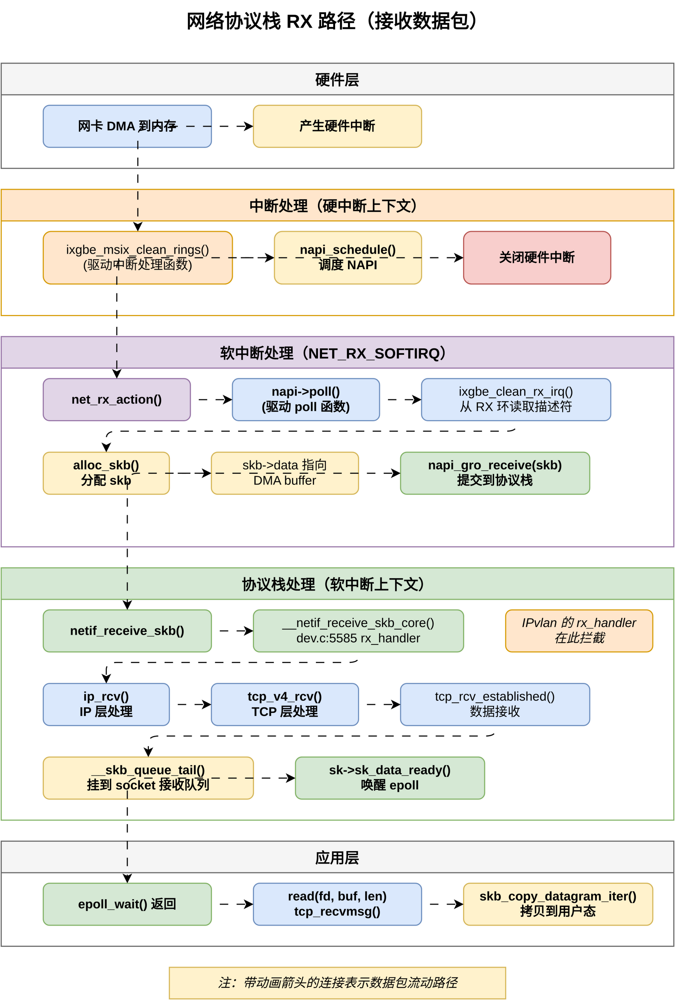
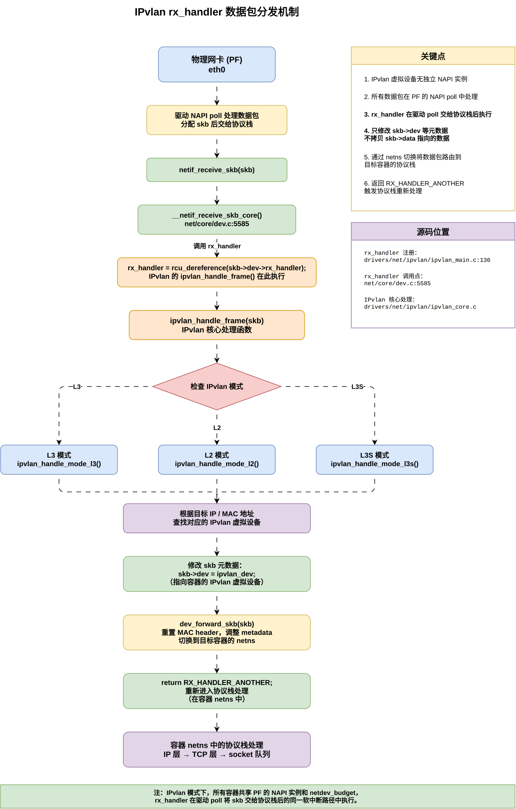

# Linux 内核网络知识汇编

## 文档概述

本文档汇总了理解容器网络模式（IPvlan、Host Network、VF 直通）所需的 Linux 内核网络栈核心知识。

**配套文档**：
- 《容器网络模式对比分析》— 三种网络模式的端到端对比
- 《Redis 容器网络模式数据流分析》— 以 Redis 为例的实战分析

---

## 目录

- [一、NAPI（New API）— 高性能网络中断处理](#一napinew-api-高性能网络中断处理)
- [二、skb（socket buffer）— 内核网络数据包表示](#二skbsocket-buffer-内核网络数据包表示)
- [三、网络协议栈处理流程](#三网络协议栈处理流程)
- [四、容器网络模式中的关键概念](#四容器网络模式中的关键概念)

---

## 一、NAPI（New API）— 高性能网络中断处理

### 1.1 传统中断模式的问题

**传统模式（Legacy Interrupt）**：
```
网卡收到数据包 → 产生硬件中断 → CPU 进入中断处理函数 → 处理一个数据包 → 返回
```

**问题**：
- **中断风暴**：高速网络下（如 10Gbps），每秒可能产生数百万个中断
- **CPU 占用过高**：频繁的上下文切换（用户态 → 中断处理 → 用户态）
- **延迟增加**：中断处理本身有开销（保存/恢复寄存器）

### 1.2 NAPI 工作原理

**NAPI（New API）** 是 Linux 内核的中断 + 轮询混合模式，用于高性能网络处理。

#### 核心思想

```
1. 第一个数据包到达
   └─> 产生硬件中断
   └─> 中断处理函数关闭网卡中断（mask interrupt）
   └─> 调度 NAPI poll
   
2. NAPI poll 轮询模式
   └─> 软中断上下文中，循环调用驱动的 poll() 函数
   └─> 每次 poll 处理多个数据包（budget，如 300 个）
   └─> 如果网卡队列仍有数据，继续 poll
   
3. 网卡队列空
   └─> 退出 poll 模式
   └─> 重新开启网卡中断（unmask interrupt）
   └─> 等待下一个数据包到达
```

#### 优势

- **减少中断次数**：高负载时，一次中断可以处理多个数据包
- **降低 CPU 占用**：减少上下文切换
- **提高吞吐量**：批量处理数据包（batch processing）

### 1.3 NAPI 核心数据结构

**源码位置**：`include/linux/netdevice.h`

```c
struct napi_struct {
    struct list_head    poll_list;     // 待轮询的 NAPI 实例链表
    unsigned long       state;         // NAPI 状态（SCHED、DISABLE 等）
    int                 weight;        // 权重（poll budget）
    int                 (*poll)(struct napi_struct *, int);  // 驱动的 poll 函数
    struct net_device   *dev;          // 关联的网络设备
    // ...
};
```

### 1.4 NAPI 状态机

```
                   硬件中断到达
                        ↓
                 napi_schedule()
                        ↓
        +---------------+---------------+
        |   NAPI_STATE_SCHED (已调度)    |
        +---------------+---------------+
                        ↓
                软中断上下文执行
                        ↓
            +----------+----------+
            |   net_rx_action()   |  ← 内核软中断处理函数
            +----------+----------+
                        ↓
        循环调用 napi->poll(napi, budget)
                        |
        +---------------+--------------+
        |                              |
    返回值 < budget              返回值 = budget
    （网卡队列空）                （还有数据）
        |                              |
        v                              v
  napi_complete()              保持 SCHED 状态
  重新开启中断                   继续 poll
        |
        v
    IDLE 状态
    等待下一次中断
```

**NAPI 状态机详细流程图**：



### 1.5 NAPI poll 函数示例（ixgbe 驱动）

**代码位置**：`drivers/net/ethernet/intel/ixgbe/ixgbe_main.c`

```c
static int ixgbe_poll(struct napi_struct *napi, int budget)
{
    struct ixgbe_q_vector *q_vector = container_of(napi, struct ixgbe_q_vector, napi);
    struct ixgbe_adapter *adapter = q_vector->adapter;
    int per_ring_budget, work_done = 0;
    bool clean_complete = true;
    
    // 1. 处理 TX 完成（释放已发送的 skb）
    ixgbe_for_each_ring(ring, q_vector->tx) {
        if (!ixgbe_clean_tx_irq(q_vector, ring, budget))
            clean_complete = false;
    }
    
    // 2. 处理 RX 数据包（分配 skb，提交到协议栈）
    ixgbe_for_each_ring(ring, q_vector->rx) {
        int cleaned = ixgbe_clean_rx_irq(q_vector, ring, per_ring_budget);
        work_done += cleaned;
    }
    
    // 3. 如果处理完所有数据包，退出 poll 模式
    if (clean_complete && (work_done < budget)) {
        napi_complete_done(napi, work_done);
        // 重新开启硬件中断
        ixgbe_irq_enable_queues(adapter, BIT_ULL(q_vector->v_idx));
    }
    
    return work_done;
}
```

### 1.6 NAPI 在容器网络模式中的体现

| 模式 | NAPI 处理位置 | 关键特征 |
|------|-------------|---------|
| **IPvlan** | 宿主机 netns 中的 PF 驱动 NAPI | 1. PF 驱动的 NAPI poll 处理所有容器的数据包<br>2. 在 `rx_handler` 中分发到各容器<br>3. 所有容器共享 PF 的硬件队列 |
| **Host Network** | 宿主机 netns 中的 PF 驱动 NAPI | 与物理机完全一致 |
| **VF 直通** | VF 驱动对应的独立 NAPI | 1. 每个 VF 有独立的 NAPI 实例<br>2. VF 有独立的硬件队列和中断<br>3. 可通过 IRQ affinity、RPS 和队列绑定降低共享竞争 |

**架构对比图**：



### 1.7 三种模式的 NAPI 核心区别详解

#### 1.7.1 Docker IPvlan 模式

**NAPI 实例归属**：IPvlan 虚拟设备**没有独立的 NAPI 实例**，所有数据包的 NAPI 处理由父设备（PF）完成。

**源码证明**（`drivers/net/ipvlan/ipvlan_main.c`）：

```c
// IPvlan 在 port 创建阶段注册 rx_handler，不创建 NAPI 实例
static int ipvlan_port_create(struct net_device *dev)
{
    // ...
    err = netdev_rx_handler_register(dev, ipvlan_handle_frame, port);
    // ...
}
```

**NAPI 处理流程**：

```
1. 物理网卡（PF）硬件中断
   └─> PF 驱动的 napi_schedule() 调度 NAPI
   
2. 软中断上下文：net_rx_action()
   └─> 遍历 CPU 的 poll_list，找到 PF 的 napi_struct
   └─> 调用 PF 的 poll() 函数（如 ixgbe_poll）
       └─> 从硬件队列读取数据包，分配 skb
       └─> napi_gro_receive(skb)
           └─> netif_receive_skb()
               └─> __netif_receive_skb_core()
                   └─> 调用 rx_handler：ipvlan_handle_frame()  // ★ IPvlan 的拦截点
                       └─> 根据目标 IP 查找对应的 IPvlan 虚拟设备
                       └─> 修改 skb->dev 指向容器的 IPvlan 设备
                       └─> 进入容器 netns，继续协议栈处理
```

**NAPI Budget 特性**：

```c
// net/core/dev.c
int netdev_budget __read_mostly = 300;           // 全局 budget（可通过 sysctl 调整）
unsigned int netdev_budget_usecs = 2000;         // 时间配额（微秒）

static void net_rx_action(struct softirq_action *h)
{
    int budget = READ_ONCE(netdev_budget);       // 本次软中断的总 budget
    unsigned long time_limit = jiffies + 
        usecs_to_jiffies(netdev_budget_usecs);
    
    for (;;) {
        struct napi_struct *n = list_first_entry(&list, ...);
        budget -= napi_poll(n, &repoll);         // 每个 NAPI 实例消耗 budget
        
        // 如果 budget 耗尽或超时，退出软中断
        if (budget <= 0 || time_after_eq(jiffies, time_limit))
            break;
    }
}
```

**关键特征**：

1. **共享 NAPI 实例**：所有 IPvlan 容器共享父设备的 NAPI 实例（如 `ixgbe` 驱动的 `q_vector->napi`）
2. **共享 NAPI Budget**：
   - 单个 NAPI 实例的 `weight` 默认为 `NAPI_POLL_WEIGHT = 64`
   - 全局 `netdev_budget = 300` 在所有 NAPI 实例间分配
   - **IPvlan 容器越多，单个容器分到的 CPU 时间片越少**（间接竞争）
3. **数据包分发时机**：驱动 poll 将 skb 交给协议栈后，`__netif_receive_skb_core()` 在同一软中断路径中调用 `rx_handler`，再分发到各容器

#### 1.7.2 Docker Host Network 模式

**NAPI 实例归属**：容器直接使用宿主机 netns，与物理机完全一致。

**NAPI 处理流程**：

```
1. 物理网卡（PF）硬件中断
   └─> PF 驱动的 napi_schedule()
   
2. 软中断上下文：net_rx_action()
   └─> PF 的 poll() 函数（如 ixgbe_poll）
       └─> 从硬件队列读取数据包
       └─> netif_receive_skb()
           └─> 直接进入宿主机协议栈（IP → TCP → socket 队列）
           └─> **无 netns 切换，无 rx_handler 拦截**
```

**源码证明**（`drivers/net/ethernet/intel/ixgbe/ixgbe_main.c`）：

```c
int ixgbe_poll(struct napi_struct *napi, int budget)
{
    struct ixgbe_q_vector *q_vector = container_of(napi, ...);
    int per_ring_budget, work_done = 0;
    bool clean_complete = true;
    
    // 1. 处理 TX 完成
    ixgbe_for_each_ring(ring, q_vector->tx) {
        if (!ixgbe_clean_tx_irq(q_vector, ring, budget))
            clean_complete = false;
    }
    
    // 2. 处理 RX 数据包（按 budget 限制）
    ixgbe_for_each_ring(ring, q_vector->rx) {
        int cleaned = ixgbe_clean_rx_irq(q_vector, ring, per_ring_budget);
        work_done += cleaned;  // 累计处理的数据包数
    }
    
    // 3. 如果处理数据包数 < budget，退出 poll 模式
    if (clean_complete && (work_done < budget)) {
        napi_complete_done(napi, work_done);
        ixgbe_irq_enable_queues(adapter, ...);  // 重新开启硬件中断
    }
    
    return work_done;  // 返回实际处理的数据包数
}
```

**关键特征**：

1. **复用宿主机 NAPI 实例**：Host Network 容器直接使用宿主机网络命名空间，与宿主机进程共享 PF 的 NAPI 实例
2. **共享 NAPI Budget**：仍与宿主机及其他 Host Network 容器处在相同 per-CPU 软中断路径中
3. **无额外开销**：没有 `rx_handler` 拦截、没有 netns 切换

#### 1.7.3 Docker VF 直通模式

**NAPI 实例归属**：每个 VF 有**独立的 NAPI 实例**；Docker 场景通常是将 VF netdev 移入容器 netns，但 IRQ/NAPI 调度仍由宿主机内核完成。

**源码证明**（`drivers/net/ethernet/intel/ixgbevf/ixgbevf_main.c`）：

```c
// VF 驱动初始化时为每个 q_vector 创建独立的 NAPI 实例
static int ixgbevf_alloc_q_vector(struct ixgbevf_adapter *adapter, int v_idx, ...)
{
    struct ixgbevf_q_vector *q_vector;
    
    q_vector = kzalloc(sizeof(struct ixgbevf_q_vector), GFP_KERNEL);
    // ...
    
    // ★ 关键：注册 VF 独立的 NAPI 实例
    netif_napi_add(adapter->netdev, &q_vector->napi, ixgbevf_poll);
    //                                  ↑                    ↑
    //                          VF 的 napi_struct     VF 的 poll 函数
    
    adapter->q_vector[v_idx] = q_vector;
    // ...
}
```

**NAPI 处理流程**：

```
Docker VF 直通场景（VF netdev 已移入容器 netns）：

1. VF 硬件中断通过 MSI-X 路由到绑定 CPU
   └─> 宿主机内核中的 VF 驱动调用 napi_schedule(&q_vector->napi)
   
2. 软中断上下文：net_rx_action()（在该 CPU 上执行）
   └─> 遍历该 CPU 的 poll_list，找到 VF 的 napi_struct
   └─> 调用 VF 的 poll() 函数：ixgbevf_poll()
       └─> 从 VF 的硬件队列读取数据包
       └─> netif_receive_skb()
           └─> 在 VF netdev 所在 netns 中继续协议栈处理
           └─> 无 rx_handler，无 netns 切换
```

**VF NAPI Poll 函数**（`drivers/net/ethernet/intel/ixgbevf/ixgbevf_main.c:1275`）：

```c
static int ixgbevf_poll(struct napi_struct *napi, int budget)
{
    struct ixgbevf_q_vector *q_vector = container_of(napi, ...);
    int per_ring_budget, work_done = 0;
    bool clean_complete = true;
    
    // 1. 处理 TX 完成
    ixgbevf_for_each_ring(ring, q_vector->tx) {
        if (!ixgbevf_clean_tx_irq(q_vector, ring, budget))
            clean_complete = false;
    }
    
    // 2. 处理 RX 数据包（budget 由 net_rx_action 传入）
    ixgbevf_for_each_ring(ring, q_vector->rx) {
        int cleaned = ixgbevf_clean_rx_irq(q_vector, ring, per_ring_budget);
        work_done += cleaned;
    }
    
    // 3. 如果处理完所有数据包，退出 poll 模式
    if (clean_complete && (work_done < budget)) {
        napi_complete_done(napi, work_done);
        ixgbevf_irq_enable_queues(adapter, ...);  // VF 重新开启中断
    }
    
    return min(work_done, budget - 1);
}
```

**关键特征**：

1. **独立 NAPI 实例**：
   - 每个 VF 有自己的 `napi_struct`，通过 `netif_napi_add()` 关联到 VF net_device
   - `napi->weight` 默认为 `NAPI_POLL_WEIGHT = 64`（与 PF 相同）
   
2. **NAPI Budget 隔离基础（依赖 per-CPU 绑定）**：
   - **关键机制**：VF 有独立 NAPI 和 MSI-X 中断，隔离效果取决于 IRQ affinity、RPS 和队列绑定
   - **软中断隔离**：每个 CPU 有独立的 `softnet_data`（per-CPU 结构），包含独立的 `poll_list`
   - **Budget 独立性**：虽然 `netdev_budget=300` 是全局变量，但每个 CPU 的软中断独立消耗 budget
   - **源码证明**（`net/core/dev.c`）：
     ```c
     // softnet_data 是 per-CPU 的
     DEFINE_PER_CPU_ALIGNED(struct softnet_data, softnet_data);
     
     static void net_rx_action(struct softirq_action *h)
     {
         struct softnet_data *sd = this_cpu_ptr(&softnet_data);  // ★ 获取当前 CPU 的 softnet_data
         int budget = READ_ONCE(netdev_budget);  // 读取全局 budget (300)
         
         // 遍历当前 CPU 的 poll_list（包含在此 CPU 上被调度的 NAPI 实例）
         for (;;) {
             struct napi_struct *n = list_first_entry(&sd->poll_list, ...);
             budget -= napi_poll(n, &repoll);
             if (budget <= 0) break;
         }
     }
     ```
   - **实际效果**：如果容器 A 的 VF 中断绑定到 CPU0、容器 B 的 VF 中断绑定到 CPU1，它们会在不同 CPU 上分别消耗本次软中断 budget
   
3. **独立硬件队列**：
   - VF 有独立的 RX/TX 描述符环（Ring Buffer）
   - VF 产生独立的 MSI-X 中断，可通过 IRQ 亲和性绑定到目标 CPU

#### 1.7.4 三种模式的 NAPI Budget 对比

| 维度 | Docker IPvlan | Docker Host Network | Docker VF 直通 |
|------|--------------|-------------------|--------------|
| **NAPI 实例数量** | 0（复用父设备 PF 的 NAPI） | N（PF 的所有 NAPI 实例） | M（VF 的独立 NAPI 实例，M 通常 < N） |
| **NAPI 实例位置** | 宿主机 netns（父设备） | 宿主机 netns（容器共享） | VF netdev 可移入容器 netns；NAPI 仍由宿主机内核调度 |
| **单个 NAPI weight** | 继承父设备（通常 64） | PF 默认 64 | VF 默认 64 |
| **softnet_data** | 共享宿主机 CPU 的 softnet_data | 共享宿主机 CPU 的 softnet_data | 取决于 VF 中断是否分散绑定到不同 CPU |
| **netdev_budget 隔离** | **间接竞争**（父设备 NAPI 被多个容器占用） | 与宿主机网络流量共享 | **条件性 per-CPU 隔离**（依赖 IRQ affinity、RPS 和队列绑定） |
| **是否可调整** | ✓（调整宿主机 `sysctl net.core.netdev_budget`） | ✓ | ✓（调整全局 `netdev_budget`，但各 CPU 独立消耗） |

**关键概念说明**：

1. **`netdev_budget` 是全局变量**（`net/core/dev.c:4507`）：
   ```c
   int netdev_budget __read_mostly = 300;  // 全局共享，不是 per-netns
   ```

2. **`softnet_data` 是 per-CPU 结构**（`net/core/dev.c`）：
   ```c
   DEFINE_PER_CPU_ALIGNED(struct softnet_data, softnet_data);
   
   struct softnet_data {
       struct list_head poll_list;  // ★ 每个 CPU 有独立的 NAPI poll_list
       // ...
   };
   ```

3. **VF 直通模式的 Budget 隔离机制**：
   - VF 的 MSI-X 中断可通过 IRQ 亲和性绑定到目标 CPU（如 CPU0）
   - 软中断 `net_rx_action()` 在该 CPU 上执行，访问 `this_cpu_ptr(&softnet_data)`
   - 该 CPU 的 `poll_list` 包含在该 CPU 上被调度的 NAPI 实例
   - 如果不同 VF 被绑定到不同 CPU，它们会分别消耗各自 CPU 上本次 `net_rx_action()` 的 budget

**关键代码证明**（`net/core/dev.c:6697`）：

```c
// NAPI poll 的核心逻辑：每个 NAPI 实例分配的 budget = napi->weight
static int __napi_poll(struct napi_struct *n, bool *repoll)
{
    int work, weight;
    
    weight = n->weight;  // ★ 从 napi_struct 读取 weight（默认 64）
    
    if (test_bit(NAPI_STATE_SCHED, &n->state)) {
        work = n->poll(n, weight);  // ★ 调用驱动的 poll 函数，传入 weight 作为 budget
        trace_napi_poll(n, work, weight);
    }
    // ...
    return work;
}
```

**`netdev_budget` 的作用**：

```c
// net/core/dev.c:6877
static void net_rx_action(struct softirq_action *h)
{
    int budget = READ_ONCE(netdev_budget);  // ★ 全局 budget，默认 300
    
    for (;;) {
        struct napi_struct *n = list_first_entry(&list, ...);
        budget -= napi_poll(n, &repoll);  // ★ 每处理一个 NAPI 实例，减少对应的 work_done
        
        // ★ 如果 budget 耗尽，停止处理剩余 NAPI 实例，退出软中断
        if (budget <= 0 || time_after_eq(jiffies, time_limit))
            break;
    }
}
```

**IPvlan 模式的 budget 竞争分析**：

假设宿主机有 1 个物理网卡（PF），配置 4 个硬件队列（4 个 NAPI 实例），所有队列的中断绑定到 CPU0：

```
                      宿主机 CPU 0 的软中断上下文
                                 |
                    +------------+------------+
                    |    net_rx_action()      |
                    | this_cpu_ptr(&softnet_data) → CPU0 的 softnet_data
                    |       budget = 300 (全局变量，CPU0 独立消耗)
                    +------------+------------+
                                 |
        +------------------------+------------------------+
        |                        |                        |
   NAPI 实例 1             NAPI 实例 2             NAPI 实例 3
   (PF queue 0)           (PF queue 1)           (PF queue 2)
   weight=64              weight=64              weight=64
   容器 A 的流量           容器 B 的流量           容器 C 的流量
        |                        |                        |
   处理 64 个包             处理 64 个包             处理 64 个包
   (消耗 budget 64)       (消耗 budget 64)       (消耗 budget 64)
        |                        |                        |
        +-----------+------------+------------+-----------+
                    |
            剩余 budget = 300 - 64*3 = 108
                    |
                    +--> 继续处理 NAPI 实例 4 或下一轮

⚠️  问题：多个容器的流量在同一个 CPU 的 softnet_data 中竞争 300 budget
```

**VF 直通模式的 budget 隔离机制**：

假设容器 A 的 VF0 中断绑定到 CPU0，容器 B 的 VF1 中断绑定到 CPU1：

```
容器 A (VF0 绑定到 CPU0)                容器 B (VF1 绑定到 CPU1)
         |                                       |
    CPU0 软中断                             CPU1 软中断
         |                                       |
 this_cpu_ptr(&softnet_data)         this_cpu_ptr(&softnet_data)
 → CPU0 的 softnet_data               → CPU1 的 softnet_data
         |                                       |
    budget = 300                            budget = 300
    (CPU0 独立消耗)                         (CPU1 独立消耗)
         |                                       |
    CPU0 的 poll_list                       CPU1 的 poll_list
    (只包含 VF0 的 NAPI)                    (只包含 VF1 的 NAPI)
         |                                       |
    VF0 NAPI 实例 1                         VF1 NAPI 实例 1
    VF0 NAPI 实例 2                         VF1 NAPI 实例 2

✅ 优势：如果 VF 中断与队列被分散绑定到不同 CPU，各 CPU 会分别消耗本次 net_rx_action() 的 budget
```

在这个过程中：
- **IPvlan 模式**：如果 3 个 NAPI 实例处理的数据包分别属于容器 A、B、C，则它们在同一个 CPU 的 softnet_data 中共享 300 budget
- **VF 直通模式**：如果各 VF 中断绑定到不同 CPU，各 CPU 有独立的 softnet_data 和本次软中断 budget；若 IRQ/RPS/队列绑定重叠，仍可能竞争

### 1.8 NAPI 相关内核参数

#### 1.8.1 关键参数说明

```bash
# 单次软中断的最大数据包数（全局配额，默认 300）
sysctl net.core.netdev_budget

# NAPI poll 的时间配额（单位：微秒，默认 2000）
sysctl net.core.netdev_budget_usecs

# 软中断处理的最大时间（微秒，默认 2000）
sysctl net.core.netdev_tstamp_prequeue
```

#### 1.8.2 NAPI weight 与 netdev_budget 的区别

**关键概念**：

| 参数 | 作用范围 | 默认值 | 可调整性 |
|------|---------|-------|---------|
| **napi->weight** | 单个 NAPI 实例单次 poll() 的最大数据包数 | `NAPI_POLL_WEIGHT = 64` | 驱动层设定，运行时通常不变 |
| **netdev_budget** | 单次软中断（net_rx_action）的总数据包配额 | 300 | 可通过 sysctl 随时调整 |

**两者关系**：

```c
// net/core/dev.c
static void net_rx_action(struct softirq_action *h)
{
    int budget = READ_ONCE(netdev_budget);  // 全局配额 300
    
    for (;;) {
        struct napi_struct *n = ...;
        int work = napi_poll(n, &repoll);   // 单个 NAPI 的 weight=64
        budget -= work;                      // 从全局扣除实际处理数
        
        if (budget <= 0) break;              // 全局耗尽就停止
    }
}
```

**关键结论**：
- 调整 `netdev_budget` **不会修改** `napi->weight` 的值
- `netdev_budget` 决定单次软中断能处理多少轮 NAPI poll
- `napi->weight` 决定每轮 poll 最多处理多少个数据包

#### 1.8.3 如何调整 NAPI weight

**方法 1：驱动层修改（需重新编译内核模块）**

```c
// Linux 6.6 的 ixgbe 当前使用 netif_napi_add()，默认 weight 为 NAPI_POLL_WEIGHT=64
// 如果确实要为该驱动自定义 weight，可将对应调用改为 netif_napi_add_weight()
netif_napi_add_weight(adapter->netdev, &q_vector->napi, 
                      ixgbe_poll, 128);  // 改为 128
```

**方法 2：修改内核默认值（需重新编译内核）**

```c
// include/linux/netdevice.h
#define NAPI_POLL_WEIGHT 128  // 改为 128
```

**方法 3：运行时调整（仅部分驱动支持）**

```bash
# 部分驱动支持通过 sysfs 调整（需查看具体驱动文档）
# 注意：大多数驱动不支持运行时修改 weight
```

**调整建议**：

| 场景 | weight 设置 | 影响 |
|------|-----------|------|
| **高吞吐量场景** | 增大（如 128） | 单次 poll 处理更多数据包，提高吞吐量，但可能增加延迟 |
| **低延迟场景** | 减小（如 32） | 降低单次 poll 的处理时间，减少延迟，但可能降低吞吐量 |
| **默认场景** | 保持 64 | 适合大多数场景，平衡延迟和吞吐量 |

**注意事项**：
- 大多数情况下，保持默认 `weight=64` 即可
- 调整 `netdev_budget` 比调整 `weight` 更简单且影响更直接
- 修改 `weight` 需要重新编译驱动或内核，调整前需通过压测验证效果

### 1.9 关键结论

**NAPI 机制对比总结**：

```
┌─────────────────────────────────────────────────────────────────────┐
│                       NAPI 实例与 Budget 分配                         │
└─────────────────────────────────────────────────────────────────────┘

1️⃣ Docker IPvlan 模式
   宿主机 netns
   ├── 物理网卡 (PF)
   │   ├── NAPI 实例 1 (queue 0, weight=64)  ←─ 所有容器共享
   │   ├── NAPI 实例 2 (queue 1, weight=64)  ←─ 所有容器共享
   │   └── NAPI 实例 N (queue N-1, weight=64) ←─ 所有容器共享
   │
   └── 全局 netdev_budget = 300  ←─ 所有 NAPI 实例共享
       └── rx_handler: ipvlan_handle_frame()  ←─ 数据包分发点
           ├─→ 容器 A (IPvlan eth0)
           ├─→ 容器 B (IPvlan eth0)
           └─→ 容器 C (IPvlan eth0)

   ⚠️  瓶颈：高并发时，多个容器争夺父设备的 NAPI 处理能力


2️⃣ Docker Host Network 模式
   宿主机 netns (容器共享)
   ├── 物理网卡 (PF)
   │   ├── NAPI 实例 1 (queue 0, weight=64)  ←─ 与宿主机共享
   │   ├── NAPI 实例 2 (queue 1, weight=64)  ←─ 与宿主机共享
   │   └── NAPI 实例 N (queue N-1, weight=64) ←─ 与宿主机共享
   │
   └── 全局 netdev_budget = 300  ←─ 与宿主机和其他 Host Network 容器共享
       └── 直接进入协议栈，无 rx_handler

   ✅ 优势：无虚拟设备路径开销；但仍共享宿主机 PF 的 NAPI 资源


3️⃣ Docker VF 直通模式
   
   容器 A netns 可见 VF0 (VF0 中断绑定到 CPU0)
   ├── VF 0 (SR-IOV Virtual Function)
   │   ├── NAPI 实例 1 (VF queue 0, weight=64)  ←─ 可在 CPU0 的 softnet_data.poll_list 调度
   │   └── NAPI 实例 2 (VF queue 1, weight=64)  ←─ 可在 CPU0 的 softnet_data.poll_list 调度
   │
   └── CPU0 的 softnet_data 独立消耗 netdev_budget=300

   容器 B netns 可见 VF1 (VF1 中断绑定到 CPU1)
   ├── VF 1 (SR-IOV Virtual Function)
   │   ├── NAPI 实例 1 (VF queue 0, weight=64)  ←─ 可在 CPU1 的 softnet_data.poll_list 调度
   │   └── NAPI 实例 2 (VF queue 1, weight=64)  ←─ 可在 CPU1 的 softnet_data.poll_list 调度
   │
   └── CPU1 的 softnet_data 独立消耗 netdev_budget=300

   ✅ 隔离条件：
      - netdev_budget=300 是全局变量，但通过 per-CPU 的 softnet_data 实现隔离
      - VF0 的中断 → CPU0 → CPU0 的 softnet_data.poll_list → CPU0 独立消耗 300 budget
      - VF1 的中断 → CPU1 → CPU1 的 softnet_data.poll_list → CPU1 独立消耗 300 budget
      - 隔离效果依赖 IRQ affinity、RPS 和队列绑定，不能无条件视为完全隔离
```

1. **NAPI 是 Linux 高性能网络的基石**，通过中断 + 轮询混合模式平衡延迟和吞吐量

2. **VF 直通模式**中，每个 VF 有独立的 NAPI 实例；budget 隔离效果依赖 IRQ affinity、RPS 和队列绑定
3. **IPvlan 模式**中，所有容器共享 PF 的 NAPI 实例和全局 budget，高并发时存在间接竞争
4. **Host Network 模式**中，容器复用宿主机物理网卡 NAPI 路径，无虚拟设备路径开销，但不独占 NAPI 资源
5. **NAPI weight** 决定单次 poll 处理的最大数据包数（默认 64），**netdev_budget** 决定单次软中断处理的总数据包数（默认 300）

---

## 二、skb（socket buffer）— 内核网络数据包表示

### 2.1 什么是 skb

`struct sk_buff`（简称 skb）是 Linux 内核中网络数据包的统一表示，贯穿整个网络栈（从网卡驱动到应用层 socket）。

**源码位置**：`include/linux/skbuff.h`

### 2.2 skb 核心数据结构

```c
struct sk_buff {
    /* 链表管理 */
    struct sk_buff      *next;        // 链表指针（用于队列）
    struct sk_buff      *prev;
    
    /* 关联对象 */
    struct net_device   *dev;         // 关联的网络设备（IPvlan 通过修改此字段实现转发）
    struct sock         *sk;          // 关联的 socket
    
    /* 数据区域指针 */
    unsigned char       *head;        // 数据区起始（固定）
    unsigned char       *data;        // 当前数据指针（协议栈处理时前后移动）
    unsigned char       *tail;        // 数据尾部
    unsigned char       *end;         // 数据区结束（固定）
    
    /* 长度信息 */
    unsigned int        len;          // 数据长度
    unsigned int        data_len;     // 分片数据长度
    
    /* 协议相关 */
    __be16              protocol;     // 协议类型（如 ETH_P_IP）
    __u16               transport_header;  // 传输层头偏移量
    __u16               network_header;    // 网络层头偏移量
    __u16               mac_header;        // MAC 层头偏移量
    
    /* 引用计数 */
    refcount_t          users;        // 引用计数（用于 skb_clone）
    
    /* 校验和 */
    __wsum              csum;         // 校验和
    __u8                ip_summed;    // 校验和状态
    
    // ... 更多字段（总共 200+ 字节）
};
```

### 2.3 skb 的内存布局

```
    head                data               tail                 end
     |                   |                  |                    |
     v                   v                  v                    v
     +-------------------+------------------+--------------------+
     |   headroom        |   数据区         |   tailroom         |
     | (用于添加协议头)   | (实际网络数据)   | (预留空间)         |
     +-------------------+------------------+--------------------+
     
协议栈处理过程中：
- RX 路径：data 指针向右移动（skb_pull），逐层剥离协议头
- TX 路径：data 指针向左移动（skb_push），逐层添加协议头
```

**skb 数据结构与内存布局详细图**：



### 2.4 skb 的生命周期

#### RX（接收）路径

```
1. 网卡 DMA 完成
   └─> 网卡驱动分配 skb：alloc_skb(size, GFP_ATOMIC)
   └─> skb->data 指向 DMA buffer
   
2. 协议栈处理
   └─> netif_receive_skb() 进入协议栈
   └─> IP 层：skb_pull(skb, ip_hdr_len)  // data 指针后移，跳过 IP 头
   └─> TCP 层：skb_pull(skb, tcp_hdr_len) // data 指针后移，跳过 TCP 头
   
3. 挂到 socket 队列
   └─> __skb_queue_tail(&sk->sk_receive_queue, skb)
   
4. read() 系统调用
   └─> skb_copy_datagram_iter(skb, 0, &msg->msg_iter, len)
   └─> 数据从 skb 拷贝到用户态 buffer
   └─> kfree_skb(skb)  // 引用计数归零，释放内存
```

#### TX（发送）路径

```
1. write() 系统调用
   └─> sock_alloc_send_skb()  // 分配 skb
   └─> skb_copy_from_iter()   // 从用户态拷贝数据到 skb
   
2. 协议栈封装
   └─> TCP 层：skb_push(skb, tcp_hdr_len)  // data 指针前移，添加 TCP 头
   └─> IP 层：skb_push(skb, ip_hdr_len)   // data 指针前移，添加 IP 头
   
3. 提交到网卡驱动
   └─> dev_queue_xmit(skb)
   └─> 网卡驱动的 ndo_start_xmit()
   
4. DMA 传输
   └─> dma_map_single(dev, skb->data, skb->len, DMA_TO_DEVICE)
   └─> 网卡从 skb->data 读取数据，DMA 到物理网卡
   └─> 发送完成后，中断或轮询释放 skb：dev_kfree_skb()
```

### 2.5 skb 的关键操作

| 操作 | 函数 | 说明 | 是否拷贝数据 |
|------|------|------|-------------|
| **分配 skb** | `alloc_skb(size, flags)` | 网卡驱动 RX 时分配，或 TCP 层发送时分配 | - |
| **克隆 skb** | `skb_clone(skb, flags)` | 只复制 skb 结构体，共享底层数据（引用计数 +1） | ✗ |
| **拷贝 skb** | `skb_copy(skb, flags)` | 深拷贝，包括结构体和数据区域 | ✓ |
| **添加头部** | `skb_push(skb, len)` | data 指针向 head 方向移动 len 字节（TX 路径添加协议头） | ✗ |
| **移除头部** | `skb_pull(skb, len)` | data 指针向 tail 方向移动 len 字节（RX 路径剥离协议头） | ✗ |
| **添加尾部** | `skb_put(skb, len)` | tail 指针向 end 方向移动 len 字节（扩展数据区） | ✗ |
| **修改 metadata** | 直接修改 `skb->dev`/`skb->sk` | IPvlan 的 `dev_forward_skb()` 就是修改这些字段 | ✗ |
| **释放 skb** | `kfree_skb(skb)` | 引用计数 -1，归零时真正释放内存 | - |

### 2.6 容器网络模式中的 skb 处理差异

| 模式 | RX 路径中的 skb 处理 | 是否拷贝数据 |
|------|---------------------|-------------|
| **IPvlan** | 1. PF 驱动分配 skb<br>2. `rx_handler` 拦截，调用 `skb_clone()` 或修改 `skb->dev`<br>3. `dev_forward_skb()` 调整 skb metadata（指向 IPvlan 虚拟设备）<br>4. 进入容器 netns，继续 L3/L4 处理 | ✗ 不拷贝数据（只克隆结构体或调整 metadata） |
| **Host Network** | 1. PF 驱动分配 skb<br>2. 直接在宿主机 netns 中完成 L2→L4 处理<br>3. 挂到 socket 接收队列 | ✗ 不拷贝数据 |
| **VF 直通** | 1. VF 驱动分配 skb（DMA 通过 IOMMU）<br>2. skb 进入 VF netdev 所在 netns 的协议栈；IRQ/NAPI 仍由宿主机内核调度<br>3. 挂到 socket 接收队列 | ✗ 不拷贝数据 |

### 2.7 关键结论

1. **三种模式在内核协议栈中都是通过 skb 指针传递**，不拷贝数据区域
2. IPvlan 的 `dev_forward_skb()` 只修改 `skb->dev`、重置 MAC header 等 metadata，**不涉及 `skb->data` 指向的数据区域**
3. **唯一的数据拷贝**发生在用户态边界：
   - RX：`read()`（skb → 用户态 buffer）
   - TX：`write()`（用户态 buffer → skb）

---

## 三、网络协议栈处理流程

### 3.1 RX 路径（接收）

```
硬件层
    └─> 网卡 DMA 到内存
    └─> 产生硬件中断

中断处理（硬中断上下文）
    └─> ixgbe_msix_clean_rings()  // 驱动中断处理函数
    └─> napi_schedule(&q_vector->napi)  // 调度 NAPI
    └─> 关闭硬件中断

软中断处理（NET_RX_SOFTIRQ）
    └─> net_rx_action()
    └─> napi->poll()  // 驱动的 poll 函数
        └─> ixgbe_clean_rx_irq()
            └─> 从 RX 环读取描述符
            └─> alloc_skb()  // 分配 skb
            └─> skb->data 指向 DMA buffer
            └─> napi_gro_receive(skb)  // 提交到协议栈

协议栈处理（软中断上下文）
    └─> netif_receive_skb()
    └─> __netif_receive_skb_core()
        ├─> 遍历 rx_handler 链（IPvlan 在此拦截）
        └─> deliver_skb()
            └─> ip_rcv()  // IP 层
                └─> ip_rcv_finish()
                    └─> tcp_v4_rcv()  // TCP 层
                        └─> tcp_v4_do_rcv()
                            └─> tcp_rcv_established()
                                └─> __skb_queue_tail(&sk->sk_receive_queue, skb)
                                └─> sk->sk_data_ready()  // 唤醒 epoll

应用层
    └─> epoll_wait() 返回
    └─> read(fd, buf, len)
        └─> tcp_recvmsg()
            └─> skb_copy_datagram_iter()  // 拷贝到用户态
            └─> kfree_skb()  // 释放 skb
```

**RX 路径完整流程图**：



### 3.2 TX 路径（发送）

```
应用层
    └─> write(fd, buf, len)
        └─> tcp_sendmsg()
            └─> sock_alloc_send_skb()  // 分配 skb
            └─> skb_copy_from_iter()  // 从用户态拷贝数据
            └─> tcp_push()
                └─> tcp_write_xmit()

协议栈处理
    └─> TCP 层：tcp_transmit_skb()
        └─> skb_push(skb, tcp_header_len)  // 添加 TCP 头
    └─> IP 层：ip_queue_xmit()
        └─> skb_push(skb, ip_header_len)  // 添加 IP 头
        └─> ip_local_out()
            └─> __ip_local_out()
                └─> nf_hook(NF_INET_LOCAL_OUT)  // iptables
                    └─> dst_output()
                        └─> ip_output()
                            └─> ip_finish_output()
                                └─> dev_queue_xmit()

Qdisc 层（流量控制）
    └─> __dev_queue_xmit()
        └─> qdisc_run()
            └─> sch_direct_xmit()

驱动层
    └─> dev->netdev_ops->ndo_start_xmit()
        └─> ixgbe_xmit_frame()
            └─> dma_map_single()  // DMA 映射
            └─> 更新 TX 描述符
            └─> writel(tail, hw->hw_addr + tx_ring->tail)  // 通知网卡

硬件层
    └─> 网卡从 DMA 地址读取数据
    └─> 发送到物理链路
    └─> 产生 TX 完成中断
        └─> ixgbe_clean_tx_irq()
            └─> dma_unmap_single()
            └─> dev_kfree_skb()  // 释放 skb
```

---

## 四、容器网络模式中的关键概念

### 4.1 rx_handler（IPvlan 的核心机制）

**注册 rx_handler**（`drivers/net/ipvlan/ipvlan_main.c`）：

```c
static int ipvlan_port_create(struct net_device *dev)
{
    // ...
    // 注册 rx_handler，拦截父设备（PF）的所有数据包
    err = netdev_rx_handler_register(dev, ipvlan_handle_frame, port);
    // ...
}
```

**rx_handler 执行时机**：

```c
// net/core/dev.c:5585
static int __netif_receive_skb_core(struct sk_buff **pskb, ...)
{
    // ...
    // 在协议栈处理前，先调用 rx_handler
    rx_handler = rcu_dereference(skb->dev->rx_handler);
    if (rx_handler) {
        // IPvlan 的 ipvlan_handle_frame() 在这里执行
        switch (rx_handler(&skb)) {
        case RX_HANDLER_CONSUMED:
            return NET_RX_SUCCESS;  // IPvlan 已处理，不继续
        case RX_HANDLER_ANOTHER:
            goto another_round;     // 重新进入协议栈（容器 netns）
        // ...
        }
    }
    // ...
}
```

**IPvlan rx_handler 数据包分发流程图**：



### 4.2 netns（Network Namespace）切换

**IPvlan 的 netns 切换**（`drivers/net/ipvlan/ipvlan_core.c`）：

```c
void ipvlan_skb_crossing_ns(struct sk_buff *skb, struct net_device *dev)
{
    bool xnet = true;
    
    if (dev)
        xnet = !net_eq(dev_net(skb->dev), dev_net(dev));

    skb_scrub_packet(skb, xnet);  // 清理旧 netns 的 metadata
    if (dev)
        skb->dev = dev;           // 修改为目标容器的虚拟设备
}
```

### 4.3 IOMMU 地址隔离（VF 直通）

**IOMMU DMA 映射**（`drivers/net/ethernet/intel/ixgbevf/ixgbevf_main.c`）：

```c
static void ixgbevf_alloc_rx_buffers(struct ixgbevf_ring *rx_ring, u16 cleaned_count)
{
    // ...
    // 将内核页面映射到 VF 的 IOMMU 地址空间
    dma = dma_map_page_attrs(rx_ring->dev, page, 0, 
                             ixgbevf_rx_pg_size(rx_ring),
                             DMA_FROM_DEVICE, IXGBEVF_RX_DMA_ATTR);
    
    // 将 IOMMU 地址写入 VF 的 RX 描述符
    rx_desc->read.pkt_addr = cpu_to_le64(dma + rx_buffer->page_offset);
    // ...
}
```

**关键点**：
- `rx_ring->dev` 指向 VF 的 PCI 设备（`adapter->pdev->dev`）
- `dma_map_page_attrs()` 返回的是 **IOMMU 地址**（IOVA），不是物理地址
- VF 硬件只能访问 IOMMU 映射范围内的内存，实现地址隔离

### 4.4 硬件队列（RSS Multi-Queue）

**RSS（Receive Side Scaling）** 是网卡的多队列技术，将不同的流（flow）分配到不同的硬件队列。

**ixgbe 驱动配置 RSS**（`drivers/net/ethernet/intel/ixgbe/ixgbe_main.c`）：

```c
static void ixgbe_configure_rx(struct ixgbe_adapter *adapter)
{
    // ...
    // 配置 RSS 重定向表（Redirection Table）
    for (i = 0; i < reta_entries; i++) {
        // 将 RSS 哈希值映射到队列索引
        u8 queue = adapter->rss_indir_tbl[i];
        // 写入硬件寄存器
        IXGBE_WRITE_REG(hw, IXGBE_RETA(i), reta);
    }
    // ...
}
```

**容器网络模式中的队列分配**：

| 模式 | 硬件队列 | 队列数 | RSS 支持 |
|------|---------|-------|---------|
| **IPvlan** | 共享 PF 的队列 | 通常 8-16 个（所有容器共享） | ✓（在 PF 层）|
| **Host Network** | 使用 PF 的队列 | 通常 8-16 个 | ✓ |
| **VF 直通** | VF 独立队列 | 每个 VF 可配置多个队列（如 2-4 个） | ✓（VF 独立 RSS）|

---

## 附录

### A. 关键源码文件

**内核版本**：Linux 6.6.0-132.0.0.111.oe2403sp3.aarch64  
**源码路径**：`/home/fsq/Desktop/kernel-src/linux-6.6.0-132.0.0.111.oe2403sp3.aarch64/`

| 组件 | 源码路径 | 关键函数/结构体 |
|------|---------|---------------|
| **NAPI 核心** | `net/core/dev.c` | `net_rx_action()`, `__napi_poll()`, `netdev_budget` |
| **NAPI 结构定义** | `include/linux/netdevice.h` | `struct napi_struct`, `NAPI_POLL_WEIGHT=64` |
| **skb 定义** | `include/linux/skbuff.h` | `struct sk_buff` |
| **rx_handler** | `net/core/dev.c:5585` | `__netif_receive_skb_core()` 中的 `rx_handler` 调用点 |
| **IPvlan 驱动** | `drivers/net/ipvlan/` | `ipvlan_handle_frame()` (无 NAPI 实例) |
| **IPvlan 主逻辑** | `drivers/net/ipvlan/ipvlan_main.c:136` | `netdev_rx_handler_register()` |
| **IPvlan 核心** | `drivers/net/ipvlan/ipvlan_core.c` | `ipvlan_handle_frame()` 实现 |
| **ixgbe 驱动 (PF)** | `drivers/net/ethernet/intel/ixgbe/` | `ixgbe_poll()` (PF NAPI poll) |
| **ixgbe NAPI poll** | `drivers/net/ethernet/intel/ixgbe/ixgbe_main.c:3138` | `ixgbe_poll()` 实现 |
| **ixgbevf 驱动 (VF)** | `drivers/net/ethernet/intel/ixgbevf/` | `ixgbevf_poll()` (VF NAPI poll) |
| **ixgbevf NAPI 初始化** | `drivers/net/ethernet/intel/ixgbevf/ixgbevf_main.c:2778` | `netif_napi_add()` |
| **ixgbevf NAPI poll** | `drivers/net/ethernet/intel/ixgbevf/ixgbevf_main.c:1275` | `ixgbevf_poll()` 实现 |
| **协议栈 IP 层** | `net/ipv4/ip_input.c` | `ip_rcv()` |
| **协议栈 TCP 层** | `net/ipv4/tcp_input.c` | `tcp_v4_rcv()` |

### B. 调试命令

```bash
# 查看 NAPI 统计
cat /proc/net/softnet_stat

# 查看网卡队列统计
ethtool -S eth0 | grep -E "rx_queue|tx_queue"

# 查看 RSS 配置
ethtool -x eth0

# 查看 IRQ 亲和性
cat /proc/interrupts | grep eth0

# 查看 skb 分配统计
cat /proc/slabinfo | grep skbuff

# 实时监控软中断
watch -n 1 'cat /proc/softirqs | grep NET'
```

---

## 附录 C. NAPI 源码深入阅读指南

对于需要深入理解 NAPI 机制的读者，推荐按以下顺序阅读内核源码：

### C.1 NAPI 核心机制（必读）

1. **NAPI 结构体定义**：`include/linux/netdevice.h:356`
   ```c
   struct napi_struct {
       int weight;                           // 单次 poll 的 budget
       int (*poll)(struct napi_struct *, int); // 驱动实现的 poll 函数
       // ...
   };
   ```

2. **软中断入口**：`net/core/dev.c:6877`
   ```c
   static void net_rx_action(struct softirq_action *h)
   {
       int budget = READ_ONCE(netdev_budget);  // 全局 budget = 300
       // 循环调用各 NAPI 实例的 poll 函数
   }
   ```

3. **NAPI poll 核心逻辑**：`net/core/dev.c:6697`
   ```c
   static int __napi_poll(struct napi_struct *n, bool *repoll)
   {
       weight = n->weight;              // 读取 NAPI weight
       work = n->poll(n, weight);       // 调用驱动 poll 函数
   }
   ```

### C.2 驱动层 NAPI 实现（选读）

**物理网卡 (PF) 驱动**：
- NAPI poll 实现：`drivers/net/ethernet/intel/ixgbe/ixgbe_main.c:3138`
- 查看 `ixgbe_poll()` 如何处理 RX 队列和 TX 完成

**虚拟功能 (VF) 驱动**：
- NAPI 初始化：`drivers/net/ethernet/intel/ixgbevf/ixgbevf_main.c:2778`
  ```c
  netif_napi_add(adapter->netdev, &q_vector->napi, ixgbevf_poll);
  ```
- NAPI poll 实现：`drivers/net/ethernet/intel/ixgbevf/ixgbevf_main.c:1275`

### C.3 IPvlan rx_handler 机制（深入理解 IPvlan）

1. **rx_handler 注册**：`drivers/net/ipvlan/ipvlan_main.c:136`
   ```c
   netdev_rx_handler_register(dev, ipvlan_handle_frame, port);
   ```

2. **rx_handler 调用点**：`net/core/dev.c:5585`（`__netif_receive_skb_core()`）
   - 在协议栈处理前拦截数据包
   - IPvlan 通过此机制实现数据包分发

3. **IPvlan 数据包处理**：`drivers/net/ipvlan/ipvlan_core.c`
   - 查看 `ipvlan_handle_frame()` 如何根据目标 IP 分发到容器

### C.4 VF 中断绑定与 per-CPU 隔离机制

**VF 中断注册**（`drivers/net/ethernet/intel/ixgbevf/ixgbevf_main.c`）：
```c
static int ixgbevf_request_irq(struct ixgbevf_adapter *adapter)
{
    // 为每个 VF 的 q_vector 注册 MSI-X 中断
    for (vector = 0; vector < adapter->num_msix_vectors; vector++) {
        struct ixgbevf_q_vector *q_vector = adapter->q_vector[vector];
        struct msix_entry *entry = &adapter->msix_entries[vector];
        
        err = request_irq(entry->vector,           // MSI-X 中断号
                         &ixgbevf_msix_clean_rings, // 中断处理函数
                         0, q_vector->name, q_vector);
        
        // 中断处理函数会调用 napi_schedule(&q_vector->napi)
    }
}
```

**中断亲和性绑定**（通过 IRQ affinity 或手动设置）：
```bash
# 查看 VF 中断号
cat /proc/interrupts | grep eth0

# 手动绑定 VF 中断到特定 CPU（例如 CPU0）
echo 1 > /proc/irq/<VF_IRQ_NUM>/smp_affinity_list  # 绑定到 CPU0
```

**per-CPU 隔离的完整路径**：
```
1. VF 硬件产生中断 → IRQ 路由到绑定的 CPU（如 CPU0）
2. 中断处理函数 ixgbevf_msix_clean_rings() 在 CPU0 上执行
3. 调用 napi_schedule(&q_vector->napi)
4. 软中断调度器将 napi 加入 CPU0 的 softnet_data.poll_list
5. net_rx_action() 在 CPU0 上执行：
   struct softnet_data *sd = this_cpu_ptr(&softnet_data);  // CPU0 的 softnet_data
   int budget = READ_ONCE(netdev_budget);                    // 读取全局 300
   // 只处理 CPU0 的 poll_list（只包含 VF 的 NAPI 实例）
6. CPU0 与 CPU1 分别消耗各自本次软中断的 budget；隔离效果取决于 IRQ affinity、RPS 和队列绑定
```

**关键源码位置**：
- `softnet_data` 定义：`include/linux/netdevice.h`（per-CPU 结构）
- `DEFINE_PER_CPU` 宏：`net/core/dev.c`（定义 per-CPU 变量）
- VF 中断注册：`drivers/net/ethernet/intel/ixgbevf/ixgbevf_main.c`

---

**文档版本**：v2.0  
**最后更新**：2026-06-24  
**变更说明**：
- v2.0 (2026-06-24)：新增三种 Docker 网络模式的 NAPI 详细对比（1.7 节），补充内核源码证明和 NAPI budget 机制分析
- v1.0 (2026-06-23)：初始版本，包含 NAPI、skb、协议栈基础知识
