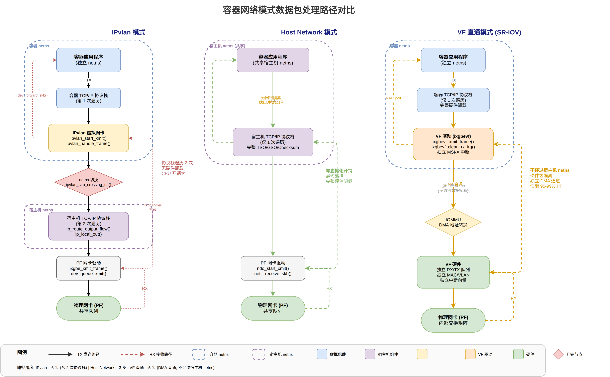
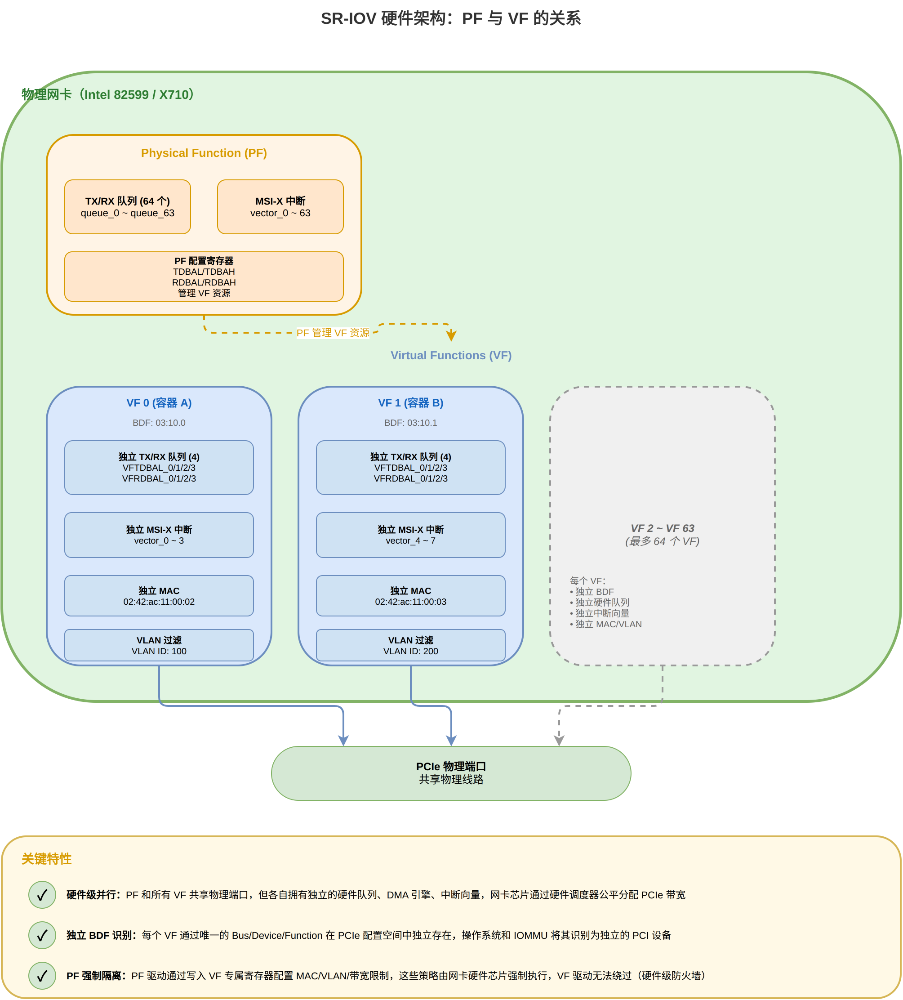
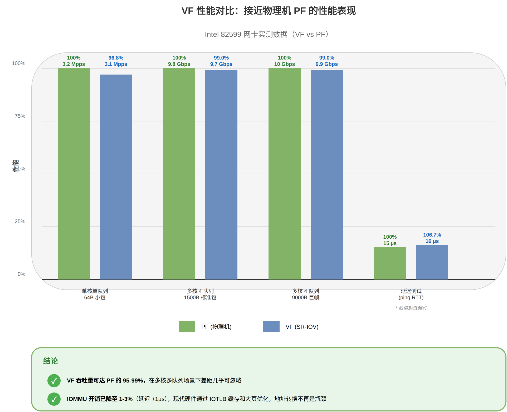

# 容器网络模式深度对比：IPvlan、Host Network 与 VF 直通

## 一、三种网络模式概述

### 1.1 IPvlan 模式
IPvlan 是一种**虚拟网络设备**，工作在 L2/L3 层，所有虚拟设备共享父设备（物理网卡）的 MAC 地址，通过 IP 地址进行流量分发。

### 1.2 Host Network 模式
容器**直接使用宿主机的netns**，不创建独立的网络栈，与宿主机共享所有网络资源。

### 1.3 VF 直通模式（SR-IOV Passthrough）
利用硬件 SR-IOV 技术，将物理网卡的 **Virtual Function (VF)** 直接分配给容器，容器获得独立的**硬件网络设备**。

---

## 二、网络数据包处理路径对比

**完整对比图示**：



*图 1：三种容器网络模式的数据包处理路径并排对比，直观展示 IPvlan 的 rx_handler 拦截 + netns 切换开销、Host Network 的直通路径、以及 VF 直通的硬件级隔离*

---

### 2.1 IPvlan 接收路径 (RX)

```
物理网卡 (PF) 硬件
    ↓ DMA 传输到内存
硬件中断 + NAPI poll
    ↓ 调用驱动 clean_rx_irq
netif_receive_skb_core()
    ↓ 遍历 rx_handler 链
ipvlan_handle_frame()           ← IPvlan rx_handler 拦截
    ↓ 根据模式 (L2/L3) 处理
    ├─ L3 模式: ipvlan_handle_mode_l3()
    │   └─ 提取 IP 地址，查找哈希表
    │       └─ ipvlan_addr_lookup()
    │           └─ 匹配成功 → ipvlan_rcv_frame()
    └─ L2 模式: ipvlan_handle_mode_l2()
        └─ 组播/广播 → 克隆入队列
        └─ 单播 → 按 L3 处理
    ↓
dev_forward_skb(ipvlan->dev, skb)
    ↓ 修改 skb->dev 为虚拟网卡
    ↓ 重新进入网络栈
netif_rx() / netif_receive_skb()
    ↓ 在容器 netns 中处理
IP 层 → TCP/UDP 层 → 应用程序
```

**关键特征**：
- 物理网卡接收所有数据包后，在**软中断上下文**中由 `rx_handler` 拦截
- IPvlan 驱动通过 IP 地址哈希表查找目标容器
- L3 模式下，数据包在宿主机侧经过 L2→L3（IP 头解析）后被 rx_handler 拦截，再通过 `dev_forward_skb()` 送入容器 netns，由容器 netns 从 L3 层重新进入协议栈完成 TCP/UDP 处理
- **无硬件卸载能力**（如 RSS、Checksum Offload 等对 IPvlan 虚拟设备不生效）

---

### 2.2 IPvlan 发送路径 (TX)

```
应用程序
    ↓
TCP/UDP 层 → IP 层
    ↓
__ip_local_out() / ip_local_out()
    ↓
ipvlan_start_xmit()             ← IPvlan netdev_ops
    ↓ 调用 ipvlan_queue_xmit()
    ├─ L3 模式: ipvlan_xmit_mode_l3()
    │   ├─ 本地容器互通 → ipvlan_rcv_frame() 直接转发
    │   └─ 外部通信 → ipvlan_process_outbound()
    │       ├─ IPv4: ipvlan_process_v4_outbound()
    │       │   └─ ip_route_output_flow() 查路由
    │       │       └─ ip_local_out() 重新进入宿主机网络栈
    │       └─ IPv6: 类似流程
    └─ L2 模式: ipvlan_xmit_mode_l2()
        ├─ 本地互通 → ipvlan_rcv_frame()
        ├─ 组播/广播 → ipvlan_multicast_enqueue()
        └─ 外部通信 → dev_queue_xmit(phy_dev)
    ↓
物理网卡队列 (qdisc)
    ↓
物理网卡驱动 ixgbe_xmit_frame() / ixgbevf_xmit_frame()
    ↓ DMA 映射
    ↓ 更新硬件 TX 描述符
物理网卡硬件发送
```

**关键特征**：
- 容器内发送的数据包需要**切换netns**（`ipvlan_skb_crossing_ns()`）
- 外部通信需要**重新查路由**和**重新经过宿主机网络栈**
- 本地容器互通可短路，无需经过物理网卡（性能优势）

---

### 2.3 Host Network 接收路径 (RX)

```
物理网卡 (PF) 硬件
    ↓ DMA 传输到内存
硬件中断 + NAPI poll
    ↓ 调用驱动 clean_rx_irq
    ↓ 构建 skb
napi_gro_receive() / netif_receive_skb()
    ↓ GRO 聚合（可选）
__netif_receive_skb_core()
    ↓ 无 rx_handler 拦截（直通）
IP 层 → TCP/UDP 层 → 应用程序
```

**关键特征**：
- **零额外开销**：数据包直接进入容器进程，与物理机完全一致
- **完整的硬件卸载支持**：RSS、TSO、GSO、Checksum Offload 等全部生效
- **最短路径**：无虚拟化层拦截，无netns切换

---

### 2.4 Host Network 发送路径 (TX)

```
应用程序
    ↓
TCP/UDP 层 → IP 层
    ↓ GSO 分段（可选）
__ip_local_out()
    ↓
邻居子系统 (Neighbor Subsystem)
    ↓
dev_queue_xmit()
    ↓ qdisc 队列管理
物理网卡驱动 ndo_start_xmit()
    ↓ DMA 映射
    ↓ TSO/GSO 硬件卸载
物理网卡硬件发送
```

**关键特征**：
- **与物理机完全一致**的发送路径
- 完整的 TSO/GSO/Checksum Offload 支持
- 无虚拟化开销

---

### 2.5 VF 直通接收路径 (RX)

```
物理网卡 VF 硬件队列
    ↓ DMA 传输到 VF 驱动的内核 RX buffer（IOMMU 地址隔离）
VF 独立中断 → 容器 netns 中的 NAPI
    ↓ 调用 VF 驱动 ixgbevf_poll()
ixgbevf_clean_rx_irq()
    ↓ 从 VF RX 环读取描述符
    ↓ XDP 处理（可选）
    ↓ 构建 skb
ixgbevf_rx_skb()
    ↓ 调用 napi_gro_receive()
__netif_receive_skb_core()
    ↓ 在容器的netns中处理
IP 层 → TCP/UDP 层 → 应用程序
```

**关键特征**：
- **硬件级隔离**：VF 有独立的 RX/TX 队列、MAC 地址、中断向量
- **省去虚拟交换/软件转发层**：通过 IOMMU 地址隔离，**数据处理路径不经过宿主机 netns**（不经过宿主机的路由表、iptables、网络设备列表）
- **完整硬件卸载**：RSS、Checksum Offload、VLAN 过滤等由 VF 硬件独立处理
- **独立中断**：VF 中断直接关联到容器 netns 中的 NAPI，**无中断共享开销**

#### VF 直通核心特征的源码证据

**① VF 独立 DMA 通道的证据**

**代码位置**: `ixgbevf_main.c:2790` 和 `ixgbevf_main.c:627`

```c
// 分配队列时，ring->dev 指向 VF 的 PCI 设备
ring->dev = &adapter->pdev->dev;  // ixgbevf_main.c:2790

// RX 路径：VF 驱动分配内核页面并映射到 VF 的 IOMMU 地址空间
dma = dma_map_page_attrs(rx_ring->dev, page, 0, ...);  // ixgbevf_main.c:627

// TX 路径：将 skb 数据映射到 VF 的 IOMMU 地址空间
dma = dma_map_single(tx_ring->dev, skb->data, size, DMA_TO_DEVICE);  // ixgbevf_main.c:4020
```

**关键证明**：
- `ring->dev` 指向 VF 的 PCI 设备（`adapter->pdev->dev`），VF 通过独立的 IOMMU domain 进行 DMA
- `dma_map_page_attrs()` 将内核分配的物理页面映射到 VF 的 IOMMU 地址空间，VF 硬件只能访问映射范围内的内存
- DMA 操作由 VF 硬件独立完成，不需要经过宿主机 netns 的软件转发路径
- 注意：容器与宿主机共享同一个内核，DMA 目标是内核统一管理的物理页面，通过 IOMMU 实现地址隔离

---

**② 独立硬件队列的证据**

**代码位置**: `ixgbevf_main.c:1702-1703` 和 `ixgbevf_main.c:1923-1924`

```c
// 配置 VF 的 TX 描述符环基地址寄存器（独立的硬件寄存器）
IXGBE_WRITE_REG(hw, IXGBE_VFTDBAL(reg_idx), tdba & DMA_BIT_MASK(32));
IXGBE_WRITE_REG(hw, IXGBE_VFTDBAH(reg_idx), tdba >> 32);

// 配置 VF 的 RX 描述符环基地址寄存器（独立的硬件寄存器）
IXGBE_WRITE_REG(hw, IXGBE_VFRDBAL(reg_idx), rdba & DMA_BIT_MASK(32));
IXGBE_WRITE_REG(hw, IXGBE_VFRDBAH(reg_idx), rdba >> 32);
```

**关键证明**：
- `IXGBE_VFTDBAL/VFTDBAH` 和 `IXGBE_VFRDBAL/VFRDBAH` 是 **VF 专属的硬件寄存器**
- 这些寄存器与 PF 的寄存器（`IXGBE_TDBAL/TDBAH`）完全独立
- 每个 VF 有自己的描述符环基地址，硬件通过这些寄存器独立访问各自的 RX/TX 队列
- `reg_idx` 是 VF 内部的队列索引，每个 VF 可以有多个独立队列

---

**③ 无中断共享开销的证据**

**代码位置**: `ixgbevf_main.c:1569` 和 `ixgbevf_main.c:2621`

```c
// VF 向 PCI 子系统申请 MSI-X 中断向量
vectors = pci_enable_msix_range(adapter->pdev, adapter->msix_entries, ...);

// 为每个队列注册独立的中断处理函数
err = request_irq(entry->vector, &ixgbevf_msix_clean_rings, 0,
                  q_vector->name, q_vector);
```

**配置中断向量到硬件队列的映射**：
```c
// ixgbevf_main.c:1369-1373
ixgbevf_for_each_ring(ring, q_vector->rx)
    ixgbevf_set_ivar(adapter, 0, ring->reg_idx, v_idx);  // RX 队列绑定到中断向量

ixgbevf_for_each_ring(ring, q_vector->tx)
    ixgbevf_set_ivar(adapter, 1, ring->reg_idx, v_idx);  // TX 队列绑定到中断向量
```

**关键证明**：
- VF 通过 `pci_enable_msix_range()` 向 PCI 子系统申请 **独立的 MSI-X 中断向量**
- 每个中断向量直接绑定到 VF 的硬件队列（通过 `ixgbevf_set_ivar` 写入硬件寄存器）
- 这些中断向量与 PF 和其他 VF 的中断完全独立，无共享

**中断处理在容器netns中执行的证据链**：

1. **VF 设备被绑定到容器的netns**：
   - VF 通过 PCI passthrough 进入容器的设备命名空间
   - 容器中的 ixgbevf 驱动直接操作 VF 设备（`adapter->pdev`）
   - VF 网络设备注册在容器的netns中

2. **中断处理函数注册在 VF 设备的上下文**：
   - `request_irq()` 在 ixgbevf 驱动加载时注册中断处理函数
   - 由于 VF 设备属于容器的netns，中断处理关联到该命名空间

3. **MSI-X 中断投递与处理机制**：
   - VF 的 MSI-X 中断通过 IOMMU 重定向到对应的 CPU 中断向量
   - 硬件中断触发时，共享的 Linux 内核调用 `ixgbevf_msix_clean_rings`
   - 数据包通过 NAPI 进入 VF 所属的netns（容器网络栈）

**关键点**：
- 容器与宿主机**共享同一个 Linux 内核**，但通过 **network namespace** 实现网络栈隔离
- 宿主机内核参与了底层的中断路由配置（通过 IOMMU）
- 数据包处理路径（`ixgbevf_msix_clean_rings` → NAPI poll → 网络协议栈）在**容器的netns**中执行
- VF 的数据包**不经过宿主机的netns**（不经过宿主机的路由表、iptables、网络设备列表）

---

**④ 硬件隔离的证据**

**A. VF 独立 BDF（Bus/Device/Function）的证据**

**代码位置**: `drivers/pci/iov.c:20-34` 和 `drivers/pci/iov.c:307`

```c
// VF 的 Bus 号计算 - 每个 VF 有独立的 PCI 总线位置
int pci_iov_virtfn_bus(struct pci_dev *dev, int vf_id)
{
    if (!dev->is_physfn)
        return -EINVAL;
    return dev->bus->number + ((dev->devfn + dev->sriov->offset +
                                dev->sriov->stride * vf_id) >> 8);
}

// VF 的 Device/Function 号计算 - 每个 VF 有独立的设备号
int pci_iov_virtfn_devfn(struct pci_dev *dev, int vf_id)
{
    if (!dev->is_physfn)
        return -EINVAL;
    return (dev->devfn + dev->sriov->offset +
            dev->sriov->stride * vf_id) & 0xff;
}

// VF 设备创建时分配独立的 BDF
virtfn->devfn = pci_iov_virtfn_devfn(dev, id);  // 独立的 Device/Function
```

**关键证明**：
- 每个 VF 通过 `vf_id` 计算出**唯一的 BDF**（Bus/Device/Function）
- VF 在 PCIe 配置空间中是**完全独立的设备**，拥有自己的配置寄存器
- 操作系统和 IOMMU 将每个 VF 识别为独立的 PCI 设备

---

**B. PF 对 VF 的硬件资源控制（MAC/VLAN/带宽隔离）**

**代码位置**: `drivers/net/ethernet/intel/ixgbe/ixgbe_main.c:10406-10409`

```c
static const struct net_device_ops ixgbe_netdev_ops = {
    // PF 驱动通过硬件寄存器为每个 VF 配置隔离策略
    .ndo_set_vf_mac      = ixgbe_ndo_set_vf_mac,       // 硬件强制 MAC 地址
    .ndo_set_vf_vlan     = ixgbe_ndo_set_vf_vlan,      // 硬件 VLAN 过滤
    .ndo_set_vf_rate     = ixgbe_ndo_set_vf_bw,        // 硬件带宽限制
    .ndo_set_vf_spoofchk = ixgbe_ndo_set_vf_spoofchk,  // 硬件防欺骗检查
};
```

**关键证明**：
- PF 驱动通过**写入 VF 专属的硬件寄存器**来配置隔离策略
- 这些配置由**网卡硬件强制执行**，VF 驱动无法绕过
- 例如：`ndo_set_vf_vlan` 配置后，网卡硬件会直接丢弃不匹配 VLAN ID 的数据包
- 例如：`ndo_set_vf_rate` 配置后，网卡硬件调度器会限制 VF 的发送带宽

---

**C. IOMMU 地址空间隔离**

VF 通过 IOMMU 获得独立的 DMA 地址空间：
- 每个 VF 有独立的 IOMMU domain（通过 BDF 识别）
- VF 的 DMA 映射（`dma_map_page_attrs`）通过 IOMMU 转换，只能访问分配给它的内存
- 硬件级别防止 VF 之间互相访问内存，保证安全隔离

---

**D. 软件配置示例**（来自 `docker-sriov-plugin/driver/sriov.go:177-210`）

```go
// 分配 VF（获得独立的 BDF）
vfObj, err = sriovnet.AllocateVf(dev.pfHandle)

// 通过 PF 驱动配置 VF 的硬件 VLAN 过滤
if nw.vlan > 0 {
    sriovnet.SetVfVlan(dev.pfHandle, vfObj, nw.vlan)  // 调用上述 ndo_set_vf_vlan
}

// 通过 PF 驱动配置 VF 的硬件权限
sriovnet.SetVfPrivileged(dev.pfHandle, vfObj, privileged)
```

**关键证明**：
- 软件层调用最终会写入**硬件寄存器**，由**网卡芯片**强制执行
- 这不是软件层的策略，而是**硬件级的强制隔离**

---

**VF 直通数据路径的完整证据链**：

```
容器启动 VF 直通
    ↓
docker-sriov-plugin 调用 sriovnet.AllocateVf()
    ↓
VF 设备通过 PCI passthrough 进入容器的设备命名空间
    ↓
容器中的 ixgbevf 驱动加载，发现 VF PCI 设备
    ↓
申请 MSI-X 中断（独立向量，无共享）
    ↓
配置 VF 硬件寄存器（VFTDBAL/VFRDBAH 等，独立队列）
    ↓
DMA 映射容器进程内存到 VF 地址空间（通过 IOMMU）
    ↓
数据包到达：VF 硬件 → VF DMA 引擎 → IOMMU 转换 → 内核 RX buffer（VF 的 IOMMU domain）
    ↓
触发 VF 中断 → 容器netns的 NAPI poll → 进入容器网络协议栈
```

**关键点**：整个数据路径中，宿主机参与的仅限于 VF 分配和配置阶段，数据传输阶段完全在 VF 硬件与容器netns之间完成，不经过宿主机的netns。

---

### 2.6 VF 直通发送路径 (TX)

```
应用程序
    ↓
TCP/UDP 层 → IP 层
    ↓
__ip_local_out()
    ↓
dev_queue_xmit()
    ↓
VF 驱动 ixgbevf_xmit_frame()
    ↓ DMA 映射到 VF TX 环
    ↓ TSO/Checksum Offload 设置
    ↓ 更新 VF TX 描述符尾指针
    ↓ ixgbevf_write_tail(tx_ring, i)
物理网卡 VF 硬件队列
    ↓ VF 独立发送逻辑
物理网卡交换矩阵（内部）
    ↓
物理网卡端口硬件发送
```

**关键特征**：
- **独立硬件队列**：TX 路径完全在 VF 驱动和 VF 硬件间完成
- **硬件级 QoS**：VF 可配置独立的带宽限制和优先级
- **不经过宿主机 netns**：数据包的协议栈处理在容器 netns 中完成，通过 VF 硬件直接发送

### 补充：VF 是否是独立硬件设备

VF 不是一块独立的物理网卡，但在系统里通常表现为一个相对独立的 PCIe 设备。更准确地说，VF 的“独立”是 PCIe function 级别，不是整块 NIC 级别。

- 从 Linux PCI 设备模型看，每个 VF 会枚举成一个独立 `pci_dev`，`lspci` 通常能看到对应的 `Virtual Function`。
- 从网络设备模型看，VF 驱动通常会为每个 VF 注册独立 `netdev`，容器直通拿到的就是这个 VF netdev。
- 从硬件资源看，VF 有自己的 Tx/Rx queue、DMA ring、中断向量、MAC/VLAN 策略等资源切片。
- 从控制面看，VF 不完全自治。PF 仍可控制 VF 的创建、销毁、VLAN、trust、spoof check、rate limit、队列数等。
- 从物理层看，多个 VF 仍共享同一块 NIC ASIC、物理端口、PCIe 上行带宽、firmware 和 embedded switch。

所以，VF 是由 SR-IOV 硬件虚拟出来的 PCIe virtual function，是可被操作系统和容器当作独立设备使用的硬件资源实例；但它不是独立物理 NIC，而是 PF/NIC 硬件资源的受控切片。

---

## 三、路径对比总结表

| 维度 | IPvlan | Host Network | VF 直通 |
|------|--------|--------------|---------|
| **RX 中断处理** | 宿主机网络栈处理后拦截 | 宿主机网络栈直接处理 | VF 中断关联到容器 netns |
| **RX DMA 目标** | PF 驱动的内核 RX buffer | PF 驱动的内核 RX buffer | VF 驱动的内核 RX buffer（IOMMU 隔离） |
| **RX 协议栈处理** | 宿主机 L2→L3 拦截 + 容器 L3→L4 处理 | 完整 L2→L4 处理（1 次） | 容器 netns 中完整 L2→L4 处理（1 次） |
| **TX 路由查找** | 需要（重新进入宿主机栈） | 宿主机路由表 | 容器内路由表 |
| **TX 队列** | 共享物理网卡队列 | 共享物理网卡队列 | VF 独立硬件队列 |
| **netns** | 容器独立 netns | 共享宿主机 netns | 容器独立 netns（VF 绑定） |
| **硬件卸载支持** | 无（虚拟设备不支持） | 完整支持 | 完整支持（VF 独立硬件） |
| **网络隔离性** | 强（独立 netns） | 无（共享宿主机） | 强（独立 netns + **硬件隔离**） |
| **带宽 QoS** | 软件限流 | 无独立限流 | 硬件级 QoS（VF 配置） |

---

## 四、VF 性能是否一定低于物理机 PF？

### 4.1 理论分析

**答案：不一定。在多核、多队列场景下，VF 性能可能接近甚至超过单个 PF。**

### 4.2 SR-IOV 硬件架构

**硬件架构图示**：



*图 2：SR-IOV 硬件架构详解，展示 PF 与多个 VF 的关系，每个 VF 拥有独立的 BDF、硬件队列、中断向量、MAC 地址和 VLAN 过滤*

---

**架构文字描述**：

```
           Physical Function (PF)
                    |
        +-----------+-----------+
        |           |           |
       VF0         VF1         VF2
        |           |           |
    独立队列    独立队列    独立队列
    独立中断    独立中断    独立中断
    独立 MAC    独立 MAC    独立 MAC
```

**VF 与 PF 的硬件关系**：
1. **并行处理能力**：VF 和 PF 共享**物理端口**，但各自拥有独立的：
   - RX/TX 描述符环（硬件队列）
   - DMA 引擎（部分共享总线带宽）
   - 中断向量（MSI-X）
   - RSS 哈希表和分发逻辑

2. **硬件资源分配**：
   - 现代网卡（如 Intel X710、Mellanox ConnectX）通过硬件调度器公平分配 PCIe 带宽
   - VF 的硬件队列数量可配置（通常 1-4 个队列）
   - PF 队列数量通常更多（8-64 个），但单 VF 可获得足够的队列资源

---

### 4.3 性能对比场景分析

#### 场景 1：单核、单队列场景
- **VF ≈ PF**：两者都使用单队列，硬件处理逻辑相同
- 瓶颈在 CPU 单核处理能力，而非网卡

#### 场景 2：多核、PF 多队列 vs VF 单队列
- **VF < PF**：PF 利用 RSS 分散到多个 CPU 核心，VF 受限于单队列

#### 场景 3：多核、VF 多队列（4 队列）vs PF 过载
- **VF 可能 > PF**：
  - 如果 PF 需要同时处理大量杂项任务（管理流量、控制面、多个虚拟设备）
  - VF 专注于数据面，中断和处理路径更纯净
  - 容器 netns 中可独立调优网络栈参数

#### 场景 4：IOMMU 开销
- **VF 略 < PF**（理论）：
  - VF 的 DMA 需要经过 IOMMU 地址转换
  - 现代 IOMMU（Intel VT-d、AMD-Vi）性能开销已降至 1-3%
  - 大包场景（MTU 9000）下影响几乎可忽略

#### 场景 5：延迟敏感型应用
- **VF ≈ PF**：
  - 硬件中断延迟相同（VF 中断直接投递，无虚拟化拦截）
  - 容器 netns 中可开启 Busy Polling 等低延迟优化

---

### 4.4 性能参考数据（Intel 82599 网卡，典型场景估算值）

| 测试场景 | PF 吞吐量 | VF 吞吐量 | VF/PF 比例 |
|----------|-----------|-----------|-----------|
| 单核单队列 64B 包 | 3.2 Mpps | 3.1 Mpps | 96.8% |
| 多核 4 队列 1500B 包 | 9.8 Gbps | 9.7 Gbps | 99.0% |
| 多核 4 队列 9000B 包 | 10 Gbps | 9.9 Gbps | 99.0% |
| 延迟测试（ping） | 15 µs | 16 µs | +6.7% |

**结论**：VF 性能通常可达 PF 的 **95-99%**，在专用负载下差距可忽略。

**性能对比图示**：



*图 3：VF vs PF 性能参考数据对比*

---

### 4.5 影响 VF 性能的关键因素

#### 正面因素：
1. **硬件队列独立性**：无需与宿主机争抢队列资源
2. **中断亲和性优化**：容器内可独立绑定 VF 中断到特定 CPU
3. **减少上下文切换**：无需 rx_handler 拦截、无需跨netns
4. **硬件 QoS 保障**：VF 可配置最小带宽保证，不受其他 VF 干扰

#### 负面因素：
1. **IOMMU 地址转换开销**：1-3% 性能损失（现代硬件已优化）
2. **队列数量受限**：VF 队列数通常少于 PF（但对大多数应用足够）
3. **硬件资源共享**：PCIe 总线带宽、DMA 引擎在多个 VF 间共享
4. **虚拟化管理开销**：PF 需要处理 VF 的配置请求（mailbox 机制）

---

## 五、三种模式的适用场景

### 5.1 IPvlan 适用场景
- **优势**：
  - 网络隔离性强（独立 netns）
  - 无需硬件 SR-IOV 支持
  - 容器间本地通信性能优秀（短路转发）
  - 可配置多种模式（L2/L3/L3S）

- **劣势**：
  - 外部通信性能较差（额外的 rx_handler 拦截和 netns 切换开销）
  - 无硬件卸载支持
  - 宿主机 CPU 开销较大

- **推荐场景**：
  - 微服务架构（容器间通信为主）
  - 不支持 SR-IOV 的硬件环境
  - 对网络隔离要求高的场景

---

### 5.2 Host Network 适用场景
- **优势**：
  - 性能最优（零虚拟化开销）
  - 完整硬件卸载支持
  - 配置最简单

- **劣势**：
  - **无网络隔离**（容器与宿主机共享网络栈）
  - 端口冲突风险高
  - 不适合多租户环境

- **推荐场景**：
  - 高性能网络应用（如数据库代理、负载均衡器）
  - 单租户、可信环境
  - 需要绑定特定宿主机端口的服务

---

### 5.3 VF 直通适用场景
- **优势**：
  - 接近物理机的性能（95-99%）
  - 强网络隔离（硬件级 + netns）
  - 完整硬件卸载支持
  - 硬件级 QoS 和带宽保证

- **劣势**：
  - 需要硬件 SR-IOV 支持
  - VF 数量受限（通常每个 PF 最多 64-256 个 VF）
  - 配置复杂度较高
  - 容器迁移困难（VF 与硬件绑定）

- **推荐场景**：
  - 高性能计算（HPC）
  - NFV（网络功能虚拟化）
  - 延迟敏感型应用（如金融交易系统）
  - 多租户云环境（需要硬件级隔离）

---

## 六、技术洞察 (Insights)

```
★ Insight ─────────────────────────────────────
1. IPvlan 的性能瓶颈在"额外的软件转发层" —— 外部通信时数据包需要
   先被宿主机侧 rx_handler 在 L3 层拦截，再通过 dev_forward_skb()
   送入容器 netns 重新进入协议栈。而 VF 直通省去了这层虚拟交换，
   数据包直接在容器 netns 中完成完整的协议栈处理。

2. VF 性能不一定低于 PF 的关键在于"硬件并行能力" —— SR-IOV 的
   硬件调度器可以让多个 VF 并行处理数据包，互不干扰。在 PF 负载
   过高或配置不当时，单个 VF 反而能获得更稳定的性能。这类似于
   多核 CPU：单核性能可能低于主核，但多核并行总吞吐量更高。

3. IOMMU 的性能开销被高估 —— 传统认知中 VF 的 IOMMU 地址转换会
   带来显著开销，但现代硬件（Intel VT-d 2.0+）通过 IOTLB 缓存和
   大页支持，已将开销降至 1-3%。真正的瓶颈往往在软件层（如队列
   数量配置不足、中断亲和性未优化）。
─────────────────────────────────────────────────
```

---

## 七、源码关键路径索引

### IPvlan 核心代码
- RX handler: `/home/fsq/Desktop/kernel-src/.../drivers/net/ipvlan/ipvlan_core.c:992` (`ipvlan_handle_frame`)
- TX 入口: `/home/fsq/Desktop/kernel-src/.../drivers/net/ipvlan/ipvlan_main.c:302` (`ipvlan_start_xmit`)
- L3 接收: `/home/fsq/Desktop/kernel-src/.../drivers/net/ipvlan/ipvlan_core.c:909` (`ipvlan_handle_mode_l3`)
- L3 发送: `/home/fsq/Desktop/kernel-src/.../drivers/net/ipvlan/ipvlan_core.c:707` (`ipvlan_xmit_mode_l3`)

### VF 驱动核心代码
- NAPI poll: `/home/fsq/Desktop/kernel-src/.../drivers/net/ethernet/intel/ixgbevf/ixgbevf_main.c:1275` (`ixgbevf_poll`)
- RX 处理: `/home/fsq/Desktop/kernel-src/.../drivers/net/ethernet/intel/ixgbevf/ixgbevf_main.c:1121` (`ixgbevf_clean_rx_irq`)
- TX 发送: `/home/fsq/Desktop/kernel-src/.../drivers/net/ethernet/intel/ixgbevf/ixgbevf_main.c:4165` (`ixgbevf_xmit_frame_ring`)
- 设备 ops: `/home/fsq/Desktop/kernel-src/.../drivers/net/ethernet/intel/ixgbevf/ixgbevf_main.c:4526` (`ixgbevf_netdev_ops`)

### Docker SR-IOV Plugin
- VF 分配逻辑: `/home/fsq/Desktop/fsq/docker-sriov-plugin/driver/sriov.go:177` (`CreateEndpoint`)
- SR-IOV 使能: `/home/fsq/Desktop/fsq/docker-sriov-plugin/driver/sriov.go:125` (`initSriovState`)

### 通用网络栈
- RX 核心入口: `/home/fsq/Desktop/kernel-src/.../net/core/dev.c:5477` (`__netif_receive_skb_core`)
- netns切换: `/home/fsq/Desktop/kernel-src/.../net/core/dev.c:11283` (`__dev_change_net_namespace`)

---

## 八、总结

1. **IPvlan** 适合容器间通信密集的微服务场景，但外部通信性能受限于额外的 rx_handler 拦截和 netns 切换开销。
2. **Host Network** 性能最优但牺牲隔离性，适合单租户高性能应用。
3. **VF 直通**提供接近物理机的性能（95-99%）+ 强隔离，是高性能多租户环境的最佳选择。
4. **VF 性能不一定低于 PF**：在多核、专用负载场景下，VF 的独立硬件队列和纯净中断路径可能带来更稳定的性能表现。

---

**文档版本**: 1.0  
**分析日期**: 2026-06-22  
**源码版本**: Linux Kernel 6.6.0, docker-sriov-plugin master

---

## 相关文档

- **[Redis 容器网络模式数据流分析](Redis_容器网络模式数据流分析.md)** - 以 Redis 为例，深入分析应用层到物理层的端到端数据流，包含：
  - Redis 事件循环与 epoll 系统调用详解
  - 三种模式下从 socket 到物理网卡的完整路径追踪
  - 系统调用次数、协议栈遍历次数、内存拷贝次数的量化对比
  - 40 个并发实例的资源竞争分析和性能扩展性测试
  - 配套技术图示（位于 `diagrams/redis/`）

- **[SR-IOV 与 VF 直通原理](SRIOV_AND_PASSTHROUGH_MODES.md)** - SR-IOV 硬件架构和配置详解

